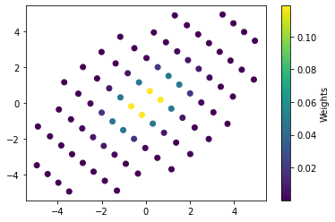

This notebook shows code for Python version of the R code for multivariate Gaussian quadrature described in the article below:

https://www.r-bloggers.com/2015/09/notes-on-multivariate-gaussian-quadrature-with-r-code/


```python
import numpy as np
import scipy
import warnings
import itertools
import matplotlib.pyplot as plt
plt.ion()
```


```python
def hermite(points, z):
    p1 = 1/np.pi**0.4
    p2 = 0
    for i in range(1, points+1):
        p3 = p2
        p2 = p1
        p1 = z * np.sqrt(2/i) * p2 - np.sqrt((i - 1)/i) * p3
        #print(p1)
    pp = np.sqrt(2 * points) * p2
    return np.array([p1, pp])
```


```python
%timeit hermite(10, 0.6)
```

    17.2 µs ± 160 ns per loop (mean ± std. dev. of 7 runs, 100000 loops each)


```python
hermite(5, 0.6) # checked against R
```


    array([ 0.40761999, -0.32733477])


```python
def gauss_hermite(points, interlim=50):
    x = np.zeros(points)
    w = np.zeros(points)
    m = np.int(np.floor((points + 1)/2))
    for i in range(1, m+1):
        if i == 1:
            z = np.sqrt(2 * points +1) - 2 * (2 * points + 1)**(-1/6)
        elif i == 2:
            z = z - np.sqrt(points)/z
        elif (i == 3 or i == 4):
            z = 1.9 * z - 0.9 *x[i-1-2]
        else:
            z = 2 * z - x[i-1-2]
        # Newton-Raphson loop ?
        for j in range(interlim):
            z1 = z
            p = hermite(points, z)
            z = z1 - p[0]/p[1]
            if np.abs(z1 - z)<1e-15:
                break
        if j == interlim - 1:
            warnings.warn("iteration limit reached!")
        x[i-1] = z
        x[points - i] = -z
        f = 2/p[1]**2
        w[i-1] = f
        w[points - i] = f
    return x * np.sqrt(2), w/np.sum(w)
```


```python
%timeit gauss_hermite(5)
```

    165 µs ± 900 ns per loop (mean ± std. dev. of 7 runs, 10000 loops each)


```python
gauss_hermite(5) # checked against R
```


    (array([ 2.85697001e+00,  1.35562618e+00,  2.65984009e-37, -1.35562618e+00,
            -2.85697001e+00]),
     array([0.01125741, 0.22207592, 0.53333333, 0.22207592, 0.01125741]))


```python
def mGauss_hermite(n, mu, sigma, prune=None):
    dm = len(mu)
    gh = gauss_hermite(n)
    l1 = [gh[0]]*dm
    l2 = [gh[1]]*dm
    x = np.array(np.meshgrid(*l1)).transpose().reshape((-1, dm))
    w = np.prod(np.array(np.meshgrid(*l2)).transpose().reshape(-1,dm),
                    axis=1)
    if prune is not None:
        qwt = np.quantile(w, prune)
        inds = np.where(w>qwt)[0]
        x = x[inds]
        w = w[inds]
    eigval, eigvec = np.linalg.eig(sigma)
    rot = np.dot(eigvec, np.diag(np.sqrt(eigval)))
    x = np.dot(rot,(x+mean).transpose()).transpose()
    return x, w
```


```python
mean = np.zeros(2)
cov = np.ones((2,2))
cov[0,1] = 0.5
cov[1,0] = 0.5
prune = 0.2
n = 10
```


```python
x, w = mGauss_hermite(n, mean, cov, prune)
print(x.shape, w.shape)
```

    (80, 2) (80,)


```python
plt.scatter(x[:,0], x[:,1], c=w)
cbar = plt.colorbar()
cbar.set_label("Weights")
```


    

    


```python
%timeit mGauss_hermite(10, mean, cov, prune)
```

    636 µs ± 5.24 µs per loop (mean ± std. dev. of 7 runs, 1000 loops each)


```python
mean = np.zeros(3)
cov = np.diag(np.ones(3))
prune = 0.2
n = 10
```


```python
x, w = mGauss_hermite(n, mean, cov, prune)
print(x.shape, w.shape)
```

    (768, 3) (768,)


```python
import plotly.graph_objects as go
import numpy as np

a, b, c = x.transpose()

fig = go.Figure(data=[go.Scatter3d(
    x=a,
    y=b,
    z=c,
    mode='markers',
    marker=dict(
        size=5,
        color=w,                # set color to an array/list of desired values
        colorscale='Viridis',   # choose a colorscale
        opacity=0.75
    )
)])

# tight layout
fig.update_layout(margin=dict(l=0, r=0, b=0, t=0))
fig.show()
```


<div>                            <div id="03015c78-48ee-4457-896e-cdd3e3028639" class="plotly-graph-div" style="height:525px; width:100%;"></div>            <script type="text/javascript">                require(["plotly"], function(Plotly) {                    window.PLOTLYENV=window.PLOTLYENV || {};                                    if (document.getElementById("03015c78-48ee-4457-896e-cdd3e3028639")) {                    Plotly.newPlot(                        "03015c78-48ee-4457-896e-cdd3e3028639",                        [{"marker": {"color": [1.126215490283116e-09, 1.126215490283116e-09, 1.5744766898207502e-09, 1.1161606031716311e-08, 2.8392802084264483e-08, 2.8392802084264483e-08, 1.1161606031716311e-08, 1.5744766898207502e-09, 1.1161606031716311e-08, 7.912562314366763e-08, 2.0127911264099636e-07, 2.0127911264099636e-07, 7.912562314366763e-08, 1.1161606031716311e-08, 1.126215490283116e-09, 2.8392802084264483e-08, 2.0127911264099636e-07, 5.120121596007824e-07, 5.120121596007824e-07, 2.0127911264099636e-07, 2.8392802084264483e-08, 1.126215490283116e-09, 1.126215490283116e-09, 2.8392802084264483e-08, 2.0127911264099636e-07, 5.120121596007824e-07, 5.120121596007824e-07, 2.0127911264099636e-07, 2.8392802084264483e-08, 1.126215490283116e-09, 1.1161606031716311e-08, 7.912562314366763e-08, 2.0127911264099636e-07, 2.0127911264099636e-07, 7.912562314366763e-08, 1.1161606031716311e-08, 1.5744766898207502e-09, 1.1161606031716311e-08, 2.8392802084264483e-08, 2.8392802084264483e-08, 1.1161606031716311e-08, 1.5744766898207502e-09, 1.126215490283116e-09, 1.126215490283116e-09, 1.126215490283116e-09, 1.126215490283116e-09, 1.0982881425904309e-08, 7.785862843288886e-08, 1.9805614186396568e-07, 1.9805614186396568e-07, 7.785862843288886e-08, 1.0982881425904309e-08, 1.0982881425904309e-08, 2.7688731093749593e-07, 1.96287890436632e-06, 4.993155294021879e-06, 4.993155294021879e-06, 1.96287890436632e-06, 2.7688731093749593e-07, 1.0982881425904309e-08, 7.785862843288886e-08, 1.96287890436632e-06, 1.3915024058563921e-05, 3.539692432880396e-05, 3.539692432880396e-05, 1.3915024058563921e-05, 1.96287890436632e-06, 7.785862843288886e-08, 1.126215490283116e-09, 1.9805614186396568e-07, 4.993155294021879e-06, 3.539692432880396e-05, 9.004240644254995e-05, 9.004240644254995e-05, 3.539692432880396e-05, 4.993155294021879e-06, 1.9805614186396568e-07, 1.126215490283116e-09, 1.126215490283116e-09, 1.9805614186396568e-07, 4.993155294021879e-06, 3.539692432880396e-05, 9.004240644254995e-05, 9.004240644254995e-05, 3.539692432880396e-05, 4.993155294021879e-06, 1.9805614186396568e-07, 1.126215490283116e-09, 7.785862843288886e-08, 1.96287890436632e-06, 1.3915024058563921e-05, 3.539692432880396e-05, 3.539692432880396e-05, 1.3915024058563921e-05, 1.96287890436632e-06, 7.785862843288886e-08, 1.0982881425904309e-08, 2.7688731093749593e-07, 1.96287890436632e-06, 4.993155294021879e-06, 4.993155294021879e-06, 1.96287890436632e-06, 2.7688731093749593e-07, 1.0982881425904309e-08, 1.0982881425904309e-08, 7.785862843288886e-08, 1.9805614186396568e-07, 1.9805614186396568e-07, 7.785862843288886e-08, 1.0982881425904309e-08, 1.126215490283116e-09, 1.126215490283116e-09, 1.5744766898207502e-09, 1.1161606031716311e-08, 2.8392802084264483e-08, 2.8392802084264483e-08, 1.1161606031716311e-08, 1.5744766898207502e-09, 1.098288142590431e-08, 2.7688731093749593e-07, 1.96287890436632e-06, 4.9931552940218794e-06, 4.9931552940218794e-06, 1.96287890436632e-06, 2.7688731093749593e-07, 1.098288142590431e-08, 1.5744766898207502e-09, 2.7688731093749593e-07, 6.980552733399375e-06, 4.948576247432064e-05, 0.00012588147762336457, 0.00012588147762336457, 4.948576247432064e-05, 6.980552733399375e-06, 2.7688731093749593e-07, 1.5744766898207502e-09, 1.1161606031716311e-08, 1.96287890436632e-06, 4.948576247432064e-05, 0.0003508089948161382, 0.0008923850502240638, 0.0008923850502240638, 0.0003508089948161382, 4.948576247432064e-05, 1.96287890436632e-06, 1.1161606031716311e-08, 2.8392802084264483e-08, 4.9931552940218794e-06, 0.00012588147762336457, 0.0008923850502240638, 0.0022700417880698273, 0.0022700417880698273, 0.0008923850502240638, 0.00012588147762336457, 4.9931552940218794e-06, 2.8392802084264483e-08, 2.8392802084264483e-08, 4.9931552940218794e-06, 0.00012588147762336457, 0.0008923850502240638, 0.0022700417880698273, 0.0022700417880698273, 0.0008923850502240638, 0.00012588147762336457, 4.9931552940218794e-06, 2.8392802084264483e-08, 1.1161606031716311e-08, 1.96287890436632e-06, 4.948576247432064e-05, 0.0003508089948161382, 0.0008923850502240638, 0.0008923850502240638, 0.0003508089948161382, 4.948576247432064e-05, 1.96287890436632e-06, 1.1161606031716311e-08, 1.5744766898207502e-09, 2.7688731093749593e-07, 6.980552733399375e-06, 4.948576247432064e-05, 0.00012588147762336457, 0.00012588147762336457, 4.948576247432064e-05, 6.980552733399375e-06, 2.7688731093749593e-07, 1.5744766898207502e-09, 1.098288142590431e-08, 2.7688731093749593e-07, 1.96287890436632e-06, 4.9931552940218794e-06, 4.9931552940218794e-06, 1.96287890436632e-06, 2.7688731093749593e-07, 1.098288142590431e-08, 1.5744766898207502e-09, 1.1161606031716311e-08, 2.8392802084264483e-08, 2.8392802084264483e-08, 1.1161606031716311e-08, 1.5744766898207502e-09, 1.1161606031716311e-08, 7.912562314366763e-08, 2.0127911264099639e-07, 2.0127911264099639e-07, 7.912562314366763e-08, 1.1161606031716311e-08, 7.785862843288886e-08, 1.96287890436632e-06, 1.3915024058563921e-05, 3.539692432880396e-05, 3.539692432880396e-05, 1.3915024058563921e-05, 1.96287890436632e-06, 7.785862843288886e-08, 1.1161606031716311e-08, 1.96287890436632e-06, 4.948576247432064e-05, 0.00035080899481613814, 0.0008923850502240639, 0.0008923850502240639, 0.00035080899481613814, 4.948576247432064e-05, 1.96287890436632e-06, 1.1161606031716311e-08, 7.912562314366763e-08, 1.3915024058563921e-05, 0.00035080899481613814, 0.0024869163308895497, 0.006326197411235313, 0.006326197411235313, 0.0024869163308895497, 0.00035080899481613814, 1.3915024058563921e-05, 7.912562314366763e-08, 2.0127911264099639e-07, 3.539692432880396e-05, 0.0008923850502240639, 0.006326197411235313, 0.01609252920527699, 0.01609252920527699, 0.006326197411235313, 0.0008923850502240639, 3.539692432880396e-05, 2.0127911264099639e-07, 2.0127911264099639e-07, 3.539692432880396e-05, 0.0008923850502240639, 0.006326197411235313, 0.01609252920527699, 0.01609252920527699, 0.006326197411235313, 0.0008923850502240639, 3.539692432880396e-05, 2.0127911264099639e-07, 7.912562314366763e-08, 1.3915024058563921e-05, 0.00035080899481613814, 0.0024869163308895497, 0.006326197411235313, 0.006326197411235313, 0.0024869163308895497, 0.00035080899481613814, 1.3915024058563921e-05, 7.912562314366763e-08, 1.1161606031716311e-08, 1.96287890436632e-06, 4.948576247432064e-05, 0.00035080899481613814, 0.0008923850502240639, 0.0008923850502240639, 0.00035080899481613814, 4.948576247432064e-05, 1.96287890436632e-06, 1.1161606031716311e-08, 7.785862843288886e-08, 1.96287890436632e-06, 1.3915024058563921e-05, 3.539692432880396e-05, 3.539692432880396e-05, 1.3915024058563921e-05, 1.96287890436632e-06, 7.785862843288886e-08, 1.1161606031716311e-08, 7.912562314366763e-08, 2.0127911264099639e-07, 2.0127911264099639e-07, 7.912562314366763e-08, 1.1161606031716311e-08, 1.1262154902831158e-09, 2.839280208426448e-08, 2.0127911264099639e-07, 5.120121596007825e-07, 5.120121596007825e-07, 2.0127911264099639e-07, 2.839280208426448e-08, 1.1262154902831158e-09, 1.1262154902831158e-09, 1.9805614186396568e-07, 4.993155294021879e-06, 3.539692432880396e-05, 9.004240644254996e-05, 9.004240644254996e-05, 3.539692432880396e-05, 4.993155294021879e-06, 1.9805614186396568e-07, 1.1262154902831158e-09, 2.839280208426448e-08, 4.993155294021879e-06, 0.00012588147762336457, 0.0008923850502240639, 0.0022700417880698273, 0.0022700417880698273, 0.0008923850502240639, 0.00012588147762336457, 4.993155294021879e-06, 2.839280208426448e-08, 2.0127911264099639e-07, 3.539692432880396e-05, 0.0008923850502240639, 0.006326197411235314, 0.01609252920527699, 0.01609252920527699, 0.006326197411235314, 0.0008923850502240639, 3.539692432880396e-05, 2.0127911264099639e-07, 5.120121596007825e-07, 9.004240644254996e-05, 0.0022700417880698273, 0.01609252920527699, 0.04093604410174802, 0.04093604410174802, 0.01609252920527699, 0.0022700417880698273, 9.004240644254996e-05, 5.120121596007825e-07, 5.120121596007825e-07, 9.004240644254996e-05, 0.0022700417880698273, 0.01609252920527699, 0.04093604410174802, 0.04093604410174802, 0.01609252920527699, 0.0022700417880698273, 9.004240644254996e-05, 5.120121596007825e-07, 2.0127911264099639e-07, 3.539692432880396e-05, 0.0008923850502240639, 0.006326197411235314, 0.01609252920527699, 0.01609252920527699, 0.006326197411235314, 0.0008923850502240639, 3.539692432880396e-05, 2.0127911264099639e-07, 2.839280208426448e-08, 4.993155294021879e-06, 0.00012588147762336457, 0.0008923850502240639, 0.0022700417880698273, 0.0022700417880698273, 0.0008923850502240639, 0.00012588147762336457, 4.993155294021879e-06, 2.839280208426448e-08, 1.1262154902831158e-09, 1.9805614186396568e-07, 4.993155294021879e-06, 3.539692432880396e-05, 9.004240644254996e-05, 9.004240644254996e-05, 3.539692432880396e-05, 4.993155294021879e-06, 1.9805614186396568e-07, 1.1262154902831158e-09, 1.1262154902831158e-09, 2.839280208426448e-08, 2.0127911264099639e-07, 5.120121596007825e-07, 5.120121596007825e-07, 2.0127911264099639e-07, 2.839280208426448e-08, 1.1262154902831158e-09, 1.1262154902831158e-09, 2.839280208426448e-08, 2.0127911264099639e-07, 5.120121596007825e-07, 5.120121596007825e-07, 2.0127911264099639e-07, 2.839280208426448e-08, 1.1262154902831158e-09, 1.1262154902831158e-09, 1.9805614186396568e-07, 4.993155294021879e-06, 3.539692432880396e-05, 9.004240644254996e-05, 9.004240644254996e-05, 3.539692432880396e-05, 4.993155294021879e-06, 1.9805614186396568e-07, 1.1262154902831158e-09, 2.839280208426448e-08, 4.993155294021879e-06, 0.00012588147762336457, 0.0008923850502240639, 0.0022700417880698273, 0.0022700417880698273, 0.0008923850502240639, 0.00012588147762336457, 4.993155294021879e-06, 2.839280208426448e-08, 2.0127911264099639e-07, 3.539692432880396e-05, 0.0008923850502240639, 0.006326197411235314, 0.01609252920527699, 0.01609252920527699, 0.006326197411235314, 0.0008923850502240639, 3.539692432880396e-05, 2.0127911264099639e-07, 5.120121596007825e-07, 9.004240644254996e-05, 0.0022700417880698273, 0.01609252920527699, 0.04093604410174802, 0.04093604410174802, 0.01609252920527699, 0.0022700417880698273, 9.004240644254996e-05, 5.120121596007825e-07, 5.120121596007825e-07, 9.004240644254996e-05, 0.0022700417880698273, 0.01609252920527699, 0.04093604410174802, 0.04093604410174802, 0.01609252920527699, 0.0022700417880698273, 9.004240644254996e-05, 5.120121596007825e-07, 2.0127911264099639e-07, 3.539692432880396e-05, 0.0008923850502240639, 0.006326197411235314, 0.01609252920527699, 0.01609252920527699, 0.006326197411235314, 0.0008923850502240639, 3.539692432880396e-05, 2.0127911264099639e-07, 2.839280208426448e-08, 4.993155294021879e-06, 0.00012588147762336457, 0.0008923850502240639, 0.0022700417880698273, 0.0022700417880698273, 0.0008923850502240639, 0.00012588147762336457, 4.993155294021879e-06, 2.839280208426448e-08, 1.1262154902831158e-09, 1.9805614186396568e-07, 4.993155294021879e-06, 3.539692432880396e-05, 9.004240644254996e-05, 9.004240644254996e-05, 3.539692432880396e-05, 4.993155294021879e-06, 1.9805614186396568e-07, 1.1262154902831158e-09, 1.1262154902831158e-09, 2.839280208426448e-08, 2.0127911264099639e-07, 5.120121596007825e-07, 5.120121596007825e-07, 2.0127911264099639e-07, 2.839280208426448e-08, 1.1262154902831158e-09, 1.1161606031716311e-08, 7.912562314366763e-08, 2.0127911264099639e-07, 2.0127911264099639e-07, 7.912562314366763e-08, 1.1161606031716311e-08, 7.785862843288886e-08, 1.96287890436632e-06, 1.3915024058563921e-05, 3.539692432880396e-05, 3.539692432880396e-05, 1.3915024058563921e-05, 1.96287890436632e-06, 7.785862843288886e-08, 1.1161606031716311e-08, 1.96287890436632e-06, 4.948576247432064e-05, 0.00035080899481613814, 0.0008923850502240639, 0.0008923850502240639, 0.00035080899481613814, 4.948576247432064e-05, 1.96287890436632e-06, 1.1161606031716311e-08, 7.912562314366763e-08, 1.3915024058563921e-05, 0.00035080899481613814, 0.0024869163308895497, 0.006326197411235313, 0.006326197411235313, 0.0024869163308895497, 0.00035080899481613814, 1.3915024058563921e-05, 7.912562314366763e-08, 2.0127911264099639e-07, 3.539692432880396e-05, 0.0008923850502240639, 0.006326197411235313, 0.01609252920527699, 0.01609252920527699, 0.006326197411235313, 0.0008923850502240639, 3.539692432880396e-05, 2.0127911264099639e-07, 2.0127911264099639e-07, 3.539692432880396e-05, 0.0008923850502240639, 0.006326197411235313, 0.01609252920527699, 0.01609252920527699, 0.006326197411235313, 0.0008923850502240639, 3.539692432880396e-05, 2.0127911264099639e-07, 7.912562314366763e-08, 1.3915024058563921e-05, 0.00035080899481613814, 0.0024869163308895497, 0.006326197411235313, 0.006326197411235313, 0.0024869163308895497, 0.00035080899481613814, 1.3915024058563921e-05, 7.912562314366763e-08, 1.1161606031716311e-08, 1.96287890436632e-06, 4.948576247432064e-05, 0.00035080899481613814, 0.0008923850502240639, 0.0008923850502240639, 0.00035080899481613814, 4.948576247432064e-05, 1.96287890436632e-06, 1.1161606031716311e-08, 7.785862843288886e-08, 1.96287890436632e-06, 1.3915024058563921e-05, 3.539692432880396e-05, 3.539692432880396e-05, 1.3915024058563921e-05, 1.96287890436632e-06, 7.785862843288886e-08, 1.1161606031716311e-08, 7.912562314366763e-08, 2.0127911264099639e-07, 2.0127911264099639e-07, 7.912562314366763e-08, 1.1161606031716311e-08, 1.5744766898207502e-09, 1.1161606031716311e-08, 2.8392802084264483e-08, 2.8392802084264483e-08, 1.1161606031716311e-08, 1.5744766898207502e-09, 1.098288142590431e-08, 2.7688731093749593e-07, 1.96287890436632e-06, 4.9931552940218794e-06, 4.9931552940218794e-06, 1.96287890436632e-06, 2.7688731093749593e-07, 1.098288142590431e-08, 1.5744766898207502e-09, 2.7688731093749593e-07, 6.980552733399375e-06, 4.948576247432064e-05, 0.00012588147762336457, 0.00012588147762336457, 4.948576247432064e-05, 6.980552733399375e-06, 2.7688731093749593e-07, 1.5744766898207502e-09, 1.1161606031716311e-08, 1.96287890436632e-06, 4.948576247432064e-05, 0.0003508089948161382, 0.0008923850502240638, 0.0008923850502240638, 0.0003508089948161382, 4.948576247432064e-05, 1.96287890436632e-06, 1.1161606031716311e-08, 2.8392802084264483e-08, 4.9931552940218794e-06, 0.00012588147762336457, 0.0008923850502240638, 0.0022700417880698273, 0.0022700417880698273, 0.0008923850502240638, 0.00012588147762336457, 4.9931552940218794e-06, 2.8392802084264483e-08, 2.8392802084264483e-08, 4.9931552940218794e-06, 0.00012588147762336457, 0.0008923850502240638, 0.0022700417880698273, 0.0022700417880698273, 0.0008923850502240638, 0.00012588147762336457, 4.9931552940218794e-06, 2.8392802084264483e-08, 1.1161606031716311e-08, 1.96287890436632e-06, 4.948576247432064e-05, 0.0003508089948161382, 0.0008923850502240638, 0.0008923850502240638, 0.0003508089948161382, 4.948576247432064e-05, 1.96287890436632e-06, 1.1161606031716311e-08, 1.5744766898207502e-09, 2.7688731093749593e-07, 6.980552733399375e-06, 4.948576247432064e-05, 0.00012588147762336457, 0.00012588147762336457, 4.948576247432064e-05, 6.980552733399375e-06, 2.7688731093749593e-07, 1.5744766898207502e-09, 1.098288142590431e-08, 2.7688731093749593e-07, 1.96287890436632e-06, 4.9931552940218794e-06, 4.9931552940218794e-06, 1.96287890436632e-06, 2.7688731093749593e-07, 1.098288142590431e-08, 1.5744766898207502e-09, 1.1161606031716311e-08, 2.8392802084264483e-08, 2.8392802084264483e-08, 1.1161606031716311e-08, 1.5744766898207502e-09, 1.126215490283116e-09, 1.126215490283116e-09, 1.0982881425904309e-08, 7.785862843288886e-08, 1.9805614186396568e-07, 1.9805614186396568e-07, 7.785862843288886e-08, 1.0982881425904309e-08, 1.0982881425904309e-08, 2.7688731093749593e-07, 1.96287890436632e-06, 4.993155294021879e-06, 4.993155294021879e-06, 1.96287890436632e-06, 2.7688731093749593e-07, 1.0982881425904309e-08, 7.785862843288886e-08, 1.96287890436632e-06, 1.3915024058563921e-05, 3.539692432880396e-05, 3.539692432880396e-05, 1.3915024058563921e-05, 1.96287890436632e-06, 7.785862843288886e-08, 1.126215490283116e-09, 1.9805614186396568e-07, 4.993155294021879e-06, 3.539692432880396e-05, 9.004240644254995e-05, 9.004240644254995e-05, 3.539692432880396e-05, 4.993155294021879e-06, 1.9805614186396568e-07, 1.126215490283116e-09, 1.126215490283116e-09, 1.9805614186396568e-07, 4.993155294021879e-06, 3.539692432880396e-05, 9.004240644254995e-05, 9.004240644254995e-05, 3.539692432880396e-05, 4.993155294021879e-06, 1.9805614186396568e-07, 1.126215490283116e-09, 7.785862843288886e-08, 1.96287890436632e-06, 1.3915024058563921e-05, 3.539692432880396e-05, 3.539692432880396e-05, 1.3915024058563921e-05, 1.96287890436632e-06, 7.785862843288886e-08, 1.0982881425904309e-08, 2.7688731093749593e-07, 1.96287890436632e-06, 4.993155294021879e-06, 4.993155294021879e-06, 1.96287890436632e-06, 2.7688731093749593e-07, 1.0982881425904309e-08, 1.0982881425904309e-08, 7.785862843288886e-08, 1.9805614186396568e-07, 1.9805614186396568e-07, 7.785862843288886e-08, 1.0982881425904309e-08, 1.126215490283116e-09, 1.126215490283116e-09, 1.126215490283116e-09, 1.126215490283116e-09, 1.5744766898207502e-09, 1.1161606031716311e-08, 2.8392802084264483e-08, 2.8392802084264483e-08, 1.1161606031716311e-08, 1.5744766898207502e-09, 1.1161606031716311e-08, 7.912562314366763e-08, 2.0127911264099636e-07, 2.0127911264099636e-07, 7.912562314366763e-08, 1.1161606031716311e-08, 1.126215490283116e-09, 2.8392802084264483e-08, 2.0127911264099636e-07, 5.120121596007824e-07, 5.120121596007824e-07, 2.0127911264099636e-07, 2.8392802084264483e-08, 1.126215490283116e-09, 1.126215490283116e-09, 2.8392802084264483e-08, 2.0127911264099636e-07, 5.120121596007824e-07, 5.120121596007824e-07, 2.0127911264099636e-07, 2.8392802084264483e-08, 1.126215490283116e-09, 1.1161606031716311e-08, 7.912562314366763e-08, 2.0127911264099636e-07, 2.0127911264099636e-07, 7.912562314366763e-08, 1.1161606031716311e-08, 1.5744766898207502e-09, 1.1161606031716311e-08, 2.8392802084264483e-08, 2.8392802084264483e-08, 1.1161606031716311e-08, 1.5744766898207502e-09, 1.126215490283116e-09, 1.126215490283116e-09], "colorscale": [[0.0, "#440154"], [0.1111111111111111, "#482878"], [0.2222222222222222, "#3e4989"], [0.3333333333333333, "#31688e"], [0.4444444444444444, "#26828e"], [0.5555555555555556, "#1f9e89"], [0.6666666666666666, "#35b779"], [0.7777777777777778, "#6ece58"], [0.8888888888888888, "#b5de2b"], [1.0, "#fde725"]], "opacity": 0.75, "size": 5}, "mode": "markers", "type": "scatter3d", "x": [3.581823483551927, 3.581823483551927, 2.4843258416389546, 2.4843258416389546, 2.4843258416389546, 2.4843258416389546, 2.4843258416389546, 2.4843258416389546, 1.4659890943911582, 1.4659890943911582, 1.4659890943911582, 1.4659890943911582, 1.4659890943911582, 1.4659890943911582, 0.48493570751549775, 0.48493570751549775, 0.48493570751549775, 0.48493570751549775, 0.48493570751549775, 0.48493570751549775, 0.48493570751549775, 0.48493570751549775, -0.48493570751549775, -0.48493570751549775, -0.48493570751549775, -0.48493570751549775, -0.48493570751549775, -0.48493570751549775, -0.48493570751549775, -0.48493570751549775, -1.4659890943911582, -1.4659890943911582, -1.4659890943911582, -1.4659890943911582, -1.4659890943911582, -1.4659890943911582, -2.4843258416389546, -2.4843258416389546, -2.4843258416389546, -2.4843258416389546, -2.4843258416389546, -2.4843258416389546, -3.581823483551927, -3.581823483551927, 4.859462828332312, 4.859462828332312, 3.581823483551927, 3.581823483551927, 3.581823483551927, 3.581823483551927, 3.581823483551927, 3.581823483551927, 2.4843258416389546, 2.4843258416389546, 2.4843258416389546, 2.4843258416389546, 2.4843258416389546, 2.4843258416389546, 2.4843258416389546, 2.4843258416389546, 1.4659890943911582, 1.4659890943911582, 1.4659890943911582, 1.4659890943911582, 1.4659890943911582, 1.4659890943911582, 1.4659890943911582, 1.4659890943911582, 0.48493570751549775, 0.48493570751549775, 0.48493570751549775, 0.48493570751549775, 0.48493570751549775, 0.48493570751549775, 0.48493570751549775, 0.48493570751549775, 0.48493570751549775, 0.48493570751549775, -0.48493570751549775, -0.48493570751549775, -0.48493570751549775, -0.48493570751549775, -0.48493570751549775, -0.48493570751549775, -0.48493570751549775, -0.48493570751549775, -0.48493570751549775, -0.48493570751549775, -1.4659890943911582, -1.4659890943911582, -1.4659890943911582, -1.4659890943911582, -1.4659890943911582, -1.4659890943911582, -1.4659890943911582, -1.4659890943911582, -2.4843258416389546, -2.4843258416389546, -2.4843258416389546, -2.4843258416389546, -2.4843258416389546, -2.4843258416389546, -2.4843258416389546, -2.4843258416389546, -3.581823483551927, -3.581823483551927, -3.581823483551927, -3.581823483551927, -3.581823483551927, -3.581823483551927, -4.859462828332312, -4.859462828332312, 4.859462828332312, 4.859462828332312, 4.859462828332312, 4.859462828332312, 4.859462828332312, 4.859462828332312, 3.581823483551927, 3.581823483551927, 3.581823483551927, 3.581823483551927, 3.581823483551927, 3.581823483551927, 3.581823483551927, 3.581823483551927, 2.4843258416389546, 2.4843258416389546, 2.4843258416389546, 2.4843258416389546, 2.4843258416389546, 2.4843258416389546, 2.4843258416389546, 2.4843258416389546, 2.4843258416389546, 2.4843258416389546, 1.4659890943911582, 1.4659890943911582, 1.4659890943911582, 1.4659890943911582, 1.4659890943911582, 1.4659890943911582, 1.4659890943911582, 1.4659890943911582, 1.4659890943911582, 1.4659890943911582, 0.48493570751549775, 0.48493570751549775, 0.48493570751549775, 0.48493570751549775, 0.48493570751549775, 0.48493570751549775, 0.48493570751549775, 0.48493570751549775, 0.48493570751549775, 0.48493570751549775, -0.48493570751549775, -0.48493570751549775, -0.48493570751549775, -0.48493570751549775, -0.48493570751549775, -0.48493570751549775, -0.48493570751549775, -0.48493570751549775, -0.48493570751549775, -0.48493570751549775, -1.4659890943911582, -1.4659890943911582, -1.4659890943911582, -1.4659890943911582, -1.4659890943911582, -1.4659890943911582, -1.4659890943911582, -1.4659890943911582, -1.4659890943911582, -1.4659890943911582, -2.4843258416389546, -2.4843258416389546, -2.4843258416389546, -2.4843258416389546, -2.4843258416389546, -2.4843258416389546, -2.4843258416389546, -2.4843258416389546, -2.4843258416389546, -2.4843258416389546, -3.581823483551927, -3.581823483551927, -3.581823483551927, -3.581823483551927, -3.581823483551927, -3.581823483551927, -3.581823483551927, -3.581823483551927, -4.859462828332312, -4.859462828332312, -4.859462828332312, -4.859462828332312, -4.859462828332312, -4.859462828332312, 4.859462828332312, 4.859462828332312, 4.859462828332312, 4.859462828332312, 4.859462828332312, 4.859462828332312, 3.581823483551927, 3.581823483551927, 3.581823483551927, 3.581823483551927, 3.581823483551927, 3.581823483551927, 3.581823483551927, 3.581823483551927, 2.4843258416389546, 2.4843258416389546, 2.4843258416389546, 2.4843258416389546, 2.4843258416389546, 2.4843258416389546, 2.4843258416389546, 2.4843258416389546, 2.4843258416389546, 2.4843258416389546, 1.4659890943911582, 1.4659890943911582, 1.4659890943911582, 1.4659890943911582, 1.4659890943911582, 1.4659890943911582, 1.4659890943911582, 1.4659890943911582, 1.4659890943911582, 1.4659890943911582, 0.48493570751549775, 0.48493570751549775, 0.48493570751549775, 0.48493570751549775, 0.48493570751549775, 0.48493570751549775, 0.48493570751549775, 0.48493570751549775, 0.48493570751549775, 0.48493570751549775, -0.48493570751549775, -0.48493570751549775, -0.48493570751549775, -0.48493570751549775, -0.48493570751549775, -0.48493570751549775, -0.48493570751549775, -0.48493570751549775, -0.48493570751549775, -0.48493570751549775, -1.4659890943911582, -1.4659890943911582, -1.4659890943911582, -1.4659890943911582, -1.4659890943911582, -1.4659890943911582, -1.4659890943911582, -1.4659890943911582, -1.4659890943911582, -1.4659890943911582, -2.4843258416389546, -2.4843258416389546, -2.4843258416389546, -2.4843258416389546, -2.4843258416389546, -2.4843258416389546, -2.4843258416389546, -2.4843258416389546, -2.4843258416389546, -2.4843258416389546, -3.581823483551927, -3.581823483551927, -3.581823483551927, -3.581823483551927, -3.581823483551927, -3.581823483551927, -3.581823483551927, -3.581823483551927, -4.859462828332312, -4.859462828332312, -4.859462828332312, -4.859462828332312, -4.859462828332312, -4.859462828332312, 4.859462828332312, 4.859462828332312, 4.859462828332312, 4.859462828332312, 4.859462828332312, 4.859462828332312, 4.859462828332312, 4.859462828332312, 3.581823483551927, 3.581823483551927, 3.581823483551927, 3.581823483551927, 3.581823483551927, 3.581823483551927, 3.581823483551927, 3.581823483551927, 3.581823483551927, 3.581823483551927, 2.4843258416389546, 2.4843258416389546, 2.4843258416389546, 2.4843258416389546, 2.4843258416389546, 2.4843258416389546, 2.4843258416389546, 2.4843258416389546, 2.4843258416389546, 2.4843258416389546, 1.4659890943911582, 1.4659890943911582, 1.4659890943911582, 1.4659890943911582, 1.4659890943911582, 1.4659890943911582, 1.4659890943911582, 1.4659890943911582, 1.4659890943911582, 1.4659890943911582, 0.48493570751549775, 0.48493570751549775, 0.48493570751549775, 0.48493570751549775, 0.48493570751549775, 0.48493570751549775, 0.48493570751549775, 0.48493570751549775, 0.48493570751549775, 0.48493570751549775, -0.48493570751549775, -0.48493570751549775, -0.48493570751549775, -0.48493570751549775, -0.48493570751549775, -0.48493570751549775, -0.48493570751549775, -0.48493570751549775, -0.48493570751549775, -0.48493570751549775, -1.4659890943911582, -1.4659890943911582, -1.4659890943911582, -1.4659890943911582, -1.4659890943911582, -1.4659890943911582, -1.4659890943911582, -1.4659890943911582, -1.4659890943911582, -1.4659890943911582, -2.4843258416389546, -2.4843258416389546, -2.4843258416389546, -2.4843258416389546, -2.4843258416389546, -2.4843258416389546, -2.4843258416389546, -2.4843258416389546, -2.4843258416389546, -2.4843258416389546, -3.581823483551927, -3.581823483551927, -3.581823483551927, -3.581823483551927, -3.581823483551927, -3.581823483551927, -3.581823483551927, -3.581823483551927, -3.581823483551927, -3.581823483551927, -4.859462828332312, -4.859462828332312, -4.859462828332312, -4.859462828332312, -4.859462828332312, -4.859462828332312, -4.859462828332312, -4.859462828332312, 4.859462828332312, 4.859462828332312, 4.859462828332312, 4.859462828332312, 4.859462828332312, 4.859462828332312, 4.859462828332312, 4.859462828332312, 3.581823483551927, 3.581823483551927, 3.581823483551927, 3.581823483551927, 3.581823483551927, 3.581823483551927, 3.581823483551927, 3.581823483551927, 3.581823483551927, 3.581823483551927, 2.4843258416389546, 2.4843258416389546, 2.4843258416389546, 2.4843258416389546, 2.4843258416389546, 2.4843258416389546, 2.4843258416389546, 2.4843258416389546, 2.4843258416389546, 2.4843258416389546, 1.4659890943911582, 1.4659890943911582, 1.4659890943911582, 1.4659890943911582, 1.4659890943911582, 1.4659890943911582, 1.4659890943911582, 1.4659890943911582, 1.4659890943911582, 1.4659890943911582, 0.48493570751549775, 0.48493570751549775, 0.48493570751549775, 0.48493570751549775, 0.48493570751549775, 0.48493570751549775, 0.48493570751549775, 0.48493570751549775, 0.48493570751549775, 0.48493570751549775, -0.48493570751549775, -0.48493570751549775, -0.48493570751549775, -0.48493570751549775, -0.48493570751549775, -0.48493570751549775, -0.48493570751549775, -0.48493570751549775, -0.48493570751549775, -0.48493570751549775, -1.4659890943911582, -1.4659890943911582, -1.4659890943911582, -1.4659890943911582, -1.4659890943911582, -1.4659890943911582, -1.4659890943911582, -1.4659890943911582, -1.4659890943911582, -1.4659890943911582, -2.4843258416389546, -2.4843258416389546, -2.4843258416389546, -2.4843258416389546, -2.4843258416389546, -2.4843258416389546, -2.4843258416389546, -2.4843258416389546, -2.4843258416389546, -2.4843258416389546, -3.581823483551927, -3.581823483551927, -3.581823483551927, -3.581823483551927, -3.581823483551927, -3.581823483551927, -3.581823483551927, -3.581823483551927, -3.581823483551927, -3.581823483551927, -4.859462828332312, -4.859462828332312, -4.859462828332312, -4.859462828332312, -4.859462828332312, -4.859462828332312, -4.859462828332312, -4.859462828332312, 4.859462828332312, 4.859462828332312, 4.859462828332312, 4.859462828332312, 4.859462828332312, 4.859462828332312, 3.581823483551927, 3.581823483551927, 3.581823483551927, 3.581823483551927, 3.581823483551927, 3.581823483551927, 3.581823483551927, 3.581823483551927, 2.4843258416389546, 2.4843258416389546, 2.4843258416389546, 2.4843258416389546, 2.4843258416389546, 2.4843258416389546, 2.4843258416389546, 2.4843258416389546, 2.4843258416389546, 2.4843258416389546, 1.4659890943911582, 1.4659890943911582, 1.4659890943911582, 1.4659890943911582, 1.4659890943911582, 1.4659890943911582, 1.4659890943911582, 1.4659890943911582, 1.4659890943911582, 1.4659890943911582, 0.48493570751549775, 0.48493570751549775, 0.48493570751549775, 0.48493570751549775, 0.48493570751549775, 0.48493570751549775, 0.48493570751549775, 0.48493570751549775, 0.48493570751549775, 0.48493570751549775, -0.48493570751549775, -0.48493570751549775, -0.48493570751549775, -0.48493570751549775, -0.48493570751549775, -0.48493570751549775, -0.48493570751549775, -0.48493570751549775, -0.48493570751549775, -0.48493570751549775, -1.4659890943911582, -1.4659890943911582, -1.4659890943911582, -1.4659890943911582, -1.4659890943911582, -1.4659890943911582, -1.4659890943911582, -1.4659890943911582, -1.4659890943911582, -1.4659890943911582, -2.4843258416389546, -2.4843258416389546, -2.4843258416389546, -2.4843258416389546, -2.4843258416389546, -2.4843258416389546, -2.4843258416389546, -2.4843258416389546, -2.4843258416389546, -2.4843258416389546, -3.581823483551927, -3.581823483551927, -3.581823483551927, -3.581823483551927, -3.581823483551927, -3.581823483551927, -3.581823483551927, -3.581823483551927, -4.859462828332312, -4.859462828332312, -4.859462828332312, -4.859462828332312, -4.859462828332312, -4.859462828332312, 4.859462828332312, 4.859462828332312, 4.859462828332312, 4.859462828332312, 4.859462828332312, 4.859462828332312, 3.581823483551927, 3.581823483551927, 3.581823483551927, 3.581823483551927, 3.581823483551927, 3.581823483551927, 3.581823483551927, 3.581823483551927, 2.4843258416389546, 2.4843258416389546, 2.4843258416389546, 2.4843258416389546, 2.4843258416389546, 2.4843258416389546, 2.4843258416389546, 2.4843258416389546, 2.4843258416389546, 2.4843258416389546, 1.4659890943911582, 1.4659890943911582, 1.4659890943911582, 1.4659890943911582, 1.4659890943911582, 1.4659890943911582, 1.4659890943911582, 1.4659890943911582, 1.4659890943911582, 1.4659890943911582, 0.48493570751549775, 0.48493570751549775, 0.48493570751549775, 0.48493570751549775, 0.48493570751549775, 0.48493570751549775, 0.48493570751549775, 0.48493570751549775, 0.48493570751549775, 0.48493570751549775, -0.48493570751549775, -0.48493570751549775, -0.48493570751549775, -0.48493570751549775, -0.48493570751549775, -0.48493570751549775, -0.48493570751549775, -0.48493570751549775, -0.48493570751549775, -0.48493570751549775, -1.4659890943911582, -1.4659890943911582, -1.4659890943911582, -1.4659890943911582, -1.4659890943911582, -1.4659890943911582, -1.4659890943911582, -1.4659890943911582, -1.4659890943911582, -1.4659890943911582, -2.4843258416389546, -2.4843258416389546, -2.4843258416389546, -2.4843258416389546, -2.4843258416389546, -2.4843258416389546, -2.4843258416389546, -2.4843258416389546, -2.4843258416389546, -2.4843258416389546, -3.581823483551927, -3.581823483551927, -3.581823483551927, -3.581823483551927, -3.581823483551927, -3.581823483551927, -3.581823483551927, -3.581823483551927, -4.859462828332312, -4.859462828332312, -4.859462828332312, -4.859462828332312, -4.859462828332312, -4.859462828332312, 4.859462828332312, 4.859462828332312, 3.581823483551927, 3.581823483551927, 3.581823483551927, 3.581823483551927, 3.581823483551927, 3.581823483551927, 2.4843258416389546, 2.4843258416389546, 2.4843258416389546, 2.4843258416389546, 2.4843258416389546, 2.4843258416389546, 2.4843258416389546, 2.4843258416389546, 1.4659890943911582, 1.4659890943911582, 1.4659890943911582, 1.4659890943911582, 1.4659890943911582, 1.4659890943911582, 1.4659890943911582, 1.4659890943911582, 0.48493570751549775, 0.48493570751549775, 0.48493570751549775, 0.48493570751549775, 0.48493570751549775, 0.48493570751549775, 0.48493570751549775, 0.48493570751549775, 0.48493570751549775, 0.48493570751549775, -0.48493570751549775, -0.48493570751549775, -0.48493570751549775, -0.48493570751549775, -0.48493570751549775, -0.48493570751549775, -0.48493570751549775, -0.48493570751549775, -0.48493570751549775, -0.48493570751549775, -1.4659890943911582, -1.4659890943911582, -1.4659890943911582, -1.4659890943911582, -1.4659890943911582, -1.4659890943911582, -1.4659890943911582, -1.4659890943911582, -2.4843258416389546, -2.4843258416389546, -2.4843258416389546, -2.4843258416389546, -2.4843258416389546, -2.4843258416389546, -2.4843258416389546, -2.4843258416389546, -3.581823483551927, -3.581823483551927, -3.581823483551927, -3.581823483551927, -3.581823483551927, -3.581823483551927, -4.859462828332312, -4.859462828332312, 3.581823483551927, 3.581823483551927, 2.4843258416389546, 2.4843258416389546, 2.4843258416389546, 2.4843258416389546, 2.4843258416389546, 2.4843258416389546, 1.4659890943911582, 1.4659890943911582, 1.4659890943911582, 1.4659890943911582, 1.4659890943911582, 1.4659890943911582, 0.48493570751549775, 0.48493570751549775, 0.48493570751549775, 0.48493570751549775, 0.48493570751549775, 0.48493570751549775, 0.48493570751549775, 0.48493570751549775, -0.48493570751549775, -0.48493570751549775, -0.48493570751549775, -0.48493570751549775, -0.48493570751549775, -0.48493570751549775, -0.48493570751549775, -0.48493570751549775, -1.4659890943911582, -1.4659890943911582, -1.4659890943911582, -1.4659890943911582, -1.4659890943911582, -1.4659890943911582, -2.4843258416389546, -2.4843258416389546, -2.4843258416389546, -2.4843258416389546, -2.4843258416389546, -2.4843258416389546, -3.581823483551927, -3.581823483551927], "y": [0.48493570751549775, -0.48493570751549775, 2.4843258416389546, 1.4659890943911582, 0.48493570751549775, -0.48493570751549775, -1.4659890943911582, -2.4843258416389546, 2.4843258416389546, 1.4659890943911582, 0.48493570751549775, -0.48493570751549775, -1.4659890943911582, -2.4843258416389546, 3.581823483551927, 2.4843258416389546, 1.4659890943911582, 0.48493570751549775, -0.48493570751549775, -1.4659890943911582, -2.4843258416389546, -3.581823483551927, 3.581823483551927, 2.4843258416389546, 1.4659890943911582, 0.48493570751549775, -0.48493570751549775, -1.4659890943911582, -2.4843258416389546, -3.581823483551927, 2.4843258416389546, 1.4659890943911582, 0.48493570751549775, -0.48493570751549775, -1.4659890943911582, -2.4843258416389546, 2.4843258416389546, 1.4659890943911582, 0.48493570751549775, -0.48493570751549775, -1.4659890943911582, -2.4843258416389546, 0.48493570751549775, -0.48493570751549775, 0.48493570751549775, -0.48493570751549775, 2.4843258416389546, 1.4659890943911582, 0.48493570751549775, -0.48493570751549775, -1.4659890943911582, -2.4843258416389546, 3.581823483551927, 2.4843258416389546, 1.4659890943911582, 0.48493570751549775, -0.48493570751549775, -1.4659890943911582, -2.4843258416389546, -3.581823483551927, 3.581823483551927, 2.4843258416389546, 1.4659890943911582, 0.48493570751549775, -0.48493570751549775, -1.4659890943911582, -2.4843258416389546, -3.581823483551927, 4.859462828332312, 3.581823483551927, 2.4843258416389546, 1.4659890943911582, 0.48493570751549775, -0.48493570751549775, -1.4659890943911582, -2.4843258416389546, -3.581823483551927, -4.859462828332312, 4.859462828332312, 3.581823483551927, 2.4843258416389546, 1.4659890943911582, 0.48493570751549775, -0.48493570751549775, -1.4659890943911582, -2.4843258416389546, -3.581823483551927, -4.859462828332312, 3.581823483551927, 2.4843258416389546, 1.4659890943911582, 0.48493570751549775, -0.48493570751549775, -1.4659890943911582, -2.4843258416389546, -3.581823483551927, 3.581823483551927, 2.4843258416389546, 1.4659890943911582, 0.48493570751549775, -0.48493570751549775, -1.4659890943911582, -2.4843258416389546, -3.581823483551927, 2.4843258416389546, 1.4659890943911582, 0.48493570751549775, -0.48493570751549775, -1.4659890943911582, -2.4843258416389546, 0.48493570751549775, -0.48493570751549775, 2.4843258416389546, 1.4659890943911582, 0.48493570751549775, -0.48493570751549775, -1.4659890943911582, -2.4843258416389546, 3.581823483551927, 2.4843258416389546, 1.4659890943911582, 0.48493570751549775, -0.48493570751549775, -1.4659890943911582, -2.4843258416389546, -3.581823483551927, 4.859462828332312, 3.581823483551927, 2.4843258416389546, 1.4659890943911582, 0.48493570751549775, -0.48493570751549775, -1.4659890943911582, -2.4843258416389546, -3.581823483551927, -4.859462828332312, 4.859462828332312, 3.581823483551927, 2.4843258416389546, 1.4659890943911582, 0.48493570751549775, -0.48493570751549775, -1.4659890943911582, -2.4843258416389546, -3.581823483551927, -4.859462828332312, 4.859462828332312, 3.581823483551927, 2.4843258416389546, 1.4659890943911582, 0.48493570751549775, -0.48493570751549775, -1.4659890943911582, -2.4843258416389546, -3.581823483551927, -4.859462828332312, 4.859462828332312, 3.581823483551927, 2.4843258416389546, 1.4659890943911582, 0.48493570751549775, -0.48493570751549775, -1.4659890943911582, -2.4843258416389546, -3.581823483551927, -4.859462828332312, 4.859462828332312, 3.581823483551927, 2.4843258416389546, 1.4659890943911582, 0.48493570751549775, -0.48493570751549775, -1.4659890943911582, -2.4843258416389546, -3.581823483551927, -4.859462828332312, 4.859462828332312, 3.581823483551927, 2.4843258416389546, 1.4659890943911582, 0.48493570751549775, -0.48493570751549775, -1.4659890943911582, -2.4843258416389546, -3.581823483551927, -4.859462828332312, 3.581823483551927, 2.4843258416389546, 1.4659890943911582, 0.48493570751549775, -0.48493570751549775, -1.4659890943911582, -2.4843258416389546, -3.581823483551927, 2.4843258416389546, 1.4659890943911582, 0.48493570751549775, -0.48493570751549775, -1.4659890943911582, -2.4843258416389546, 2.4843258416389546, 1.4659890943911582, 0.48493570751549775, -0.48493570751549775, -1.4659890943911582, -2.4843258416389546, 3.581823483551927, 2.4843258416389546, 1.4659890943911582, 0.48493570751549775, -0.48493570751549775, -1.4659890943911582, -2.4843258416389546, -3.581823483551927, 4.859462828332312, 3.581823483551927, 2.4843258416389546, 1.4659890943911582, 0.48493570751549775, -0.48493570751549775, -1.4659890943911582, -2.4843258416389546, -3.581823483551927, -4.859462828332312, 4.859462828332312, 3.581823483551927, 2.4843258416389546, 1.4659890943911582, 0.48493570751549775, -0.48493570751549775, -1.4659890943911582, -2.4843258416389546, -3.581823483551927, -4.859462828332312, 4.859462828332312, 3.581823483551927, 2.4843258416389546, 1.4659890943911582, 0.48493570751549775, -0.48493570751549775, -1.4659890943911582, -2.4843258416389546, -3.581823483551927, -4.859462828332312, 4.859462828332312, 3.581823483551927, 2.4843258416389546, 1.4659890943911582, 0.48493570751549775, -0.48493570751549775, -1.4659890943911582, -2.4843258416389546, -3.581823483551927, -4.859462828332312, 4.859462828332312, 3.581823483551927, 2.4843258416389546, 1.4659890943911582, 0.48493570751549775, -0.48493570751549775, -1.4659890943911582, -2.4843258416389546, -3.581823483551927, -4.859462828332312, 4.859462828332312, 3.581823483551927, 2.4843258416389546, 1.4659890943911582, 0.48493570751549775, -0.48493570751549775, -1.4659890943911582, -2.4843258416389546, -3.581823483551927, -4.859462828332312, 3.581823483551927, 2.4843258416389546, 1.4659890943911582, 0.48493570751549775, -0.48493570751549775, -1.4659890943911582, -2.4843258416389546, -3.581823483551927, 2.4843258416389546, 1.4659890943911582, 0.48493570751549775, -0.48493570751549775, -1.4659890943911582, -2.4843258416389546, 3.581823483551927, 2.4843258416389546, 1.4659890943911582, 0.48493570751549775, -0.48493570751549775, -1.4659890943911582, -2.4843258416389546, -3.581823483551927, 4.859462828332312, 3.581823483551927, 2.4843258416389546, 1.4659890943911582, 0.48493570751549775, -0.48493570751549775, -1.4659890943911582, -2.4843258416389546, -3.581823483551927, -4.859462828332312, 4.859462828332312, 3.581823483551927, 2.4843258416389546, 1.4659890943911582, 0.48493570751549775, -0.48493570751549775, -1.4659890943911582, -2.4843258416389546, -3.581823483551927, -4.859462828332312, 4.859462828332312, 3.581823483551927, 2.4843258416389546, 1.4659890943911582, 0.48493570751549775, -0.48493570751549775, -1.4659890943911582, -2.4843258416389546, -3.581823483551927, -4.859462828332312, 4.859462828332312, 3.581823483551927, 2.4843258416389546, 1.4659890943911582, 0.48493570751549775, -0.48493570751549775, -1.4659890943911582, -2.4843258416389546, -3.581823483551927, -4.859462828332312, 4.859462828332312, 3.581823483551927, 2.4843258416389546, 1.4659890943911582, 0.48493570751549775, -0.48493570751549775, -1.4659890943911582, -2.4843258416389546, -3.581823483551927, -4.859462828332312, 4.859462828332312, 3.581823483551927, 2.4843258416389546, 1.4659890943911582, 0.48493570751549775, -0.48493570751549775, -1.4659890943911582, -2.4843258416389546, -3.581823483551927, -4.859462828332312, 4.859462828332312, 3.581823483551927, 2.4843258416389546, 1.4659890943911582, 0.48493570751549775, -0.48493570751549775, -1.4659890943911582, -2.4843258416389546, -3.581823483551927, -4.859462828332312, 4.859462828332312, 3.581823483551927, 2.4843258416389546, 1.4659890943911582, 0.48493570751549775, -0.48493570751549775, -1.4659890943911582, -2.4843258416389546, -3.581823483551927, -4.859462828332312, 3.581823483551927, 2.4843258416389546, 1.4659890943911582, 0.48493570751549775, -0.48493570751549775, -1.4659890943911582, -2.4843258416389546, -3.581823483551927, 3.581823483551927, 2.4843258416389546, 1.4659890943911582, 0.48493570751549775, -0.48493570751549775, -1.4659890943911582, -2.4843258416389546, -3.581823483551927, 4.859462828332312, 3.581823483551927, 2.4843258416389546, 1.4659890943911582, 0.48493570751549775, -0.48493570751549775, -1.4659890943911582, -2.4843258416389546, -3.581823483551927, -4.859462828332312, 4.859462828332312, 3.581823483551927, 2.4843258416389546, 1.4659890943911582, 0.48493570751549775, -0.48493570751549775, -1.4659890943911582, -2.4843258416389546, -3.581823483551927, -4.859462828332312, 4.859462828332312, 3.581823483551927, 2.4843258416389546, 1.4659890943911582, 0.48493570751549775, -0.48493570751549775, -1.4659890943911582, -2.4843258416389546, -3.581823483551927, -4.859462828332312, 4.859462828332312, 3.581823483551927, 2.4843258416389546, 1.4659890943911582, 0.48493570751549775, -0.48493570751549775, -1.4659890943911582, -2.4843258416389546, -3.581823483551927, -4.859462828332312, 4.859462828332312, 3.581823483551927, 2.4843258416389546, 1.4659890943911582, 0.48493570751549775, -0.48493570751549775, -1.4659890943911582, -2.4843258416389546, -3.581823483551927, -4.859462828332312, 4.859462828332312, 3.581823483551927, 2.4843258416389546, 1.4659890943911582, 0.48493570751549775, -0.48493570751549775, -1.4659890943911582, -2.4843258416389546, -3.581823483551927, -4.859462828332312, 4.859462828332312, 3.581823483551927, 2.4843258416389546, 1.4659890943911582, 0.48493570751549775, -0.48493570751549775, -1.4659890943911582, -2.4843258416389546, -3.581823483551927, -4.859462828332312, 4.859462828332312, 3.581823483551927, 2.4843258416389546, 1.4659890943911582, 0.48493570751549775, -0.48493570751549775, -1.4659890943911582, -2.4843258416389546, -3.581823483551927, -4.859462828332312, 3.581823483551927, 2.4843258416389546, 1.4659890943911582, 0.48493570751549775, -0.48493570751549775, -1.4659890943911582, -2.4843258416389546, -3.581823483551927, 2.4843258416389546, 1.4659890943911582, 0.48493570751549775, -0.48493570751549775, -1.4659890943911582, -2.4843258416389546, 3.581823483551927, 2.4843258416389546, 1.4659890943911582, 0.48493570751549775, -0.48493570751549775, -1.4659890943911582, -2.4843258416389546, -3.581823483551927, 4.859462828332312, 3.581823483551927, 2.4843258416389546, 1.4659890943911582, 0.48493570751549775, -0.48493570751549775, -1.4659890943911582, -2.4843258416389546, -3.581823483551927, -4.859462828332312, 4.859462828332312, 3.581823483551927, 2.4843258416389546, 1.4659890943911582, 0.48493570751549775, -0.48493570751549775, -1.4659890943911582, -2.4843258416389546, -3.581823483551927, -4.859462828332312, 4.859462828332312, 3.581823483551927, 2.4843258416389546, 1.4659890943911582, 0.48493570751549775, -0.48493570751549775, -1.4659890943911582, -2.4843258416389546, -3.581823483551927, -4.859462828332312, 4.859462828332312, 3.581823483551927, 2.4843258416389546, 1.4659890943911582, 0.48493570751549775, -0.48493570751549775, -1.4659890943911582, -2.4843258416389546, -3.581823483551927, -4.859462828332312, 4.859462828332312, 3.581823483551927, 2.4843258416389546, 1.4659890943911582, 0.48493570751549775, -0.48493570751549775, -1.4659890943911582, -2.4843258416389546, -3.581823483551927, -4.859462828332312, 4.859462828332312, 3.581823483551927, 2.4843258416389546, 1.4659890943911582, 0.48493570751549775, -0.48493570751549775, -1.4659890943911582, -2.4843258416389546, -3.581823483551927, -4.859462828332312, 3.581823483551927, 2.4843258416389546, 1.4659890943911582, 0.48493570751549775, -0.48493570751549775, -1.4659890943911582, -2.4843258416389546, -3.581823483551927, 2.4843258416389546, 1.4659890943911582, 0.48493570751549775, -0.48493570751549775, -1.4659890943911582, -2.4843258416389546, 2.4843258416389546, 1.4659890943911582, 0.48493570751549775, -0.48493570751549775, -1.4659890943911582, -2.4843258416389546, 3.581823483551927, 2.4843258416389546, 1.4659890943911582, 0.48493570751549775, -0.48493570751549775, -1.4659890943911582, -2.4843258416389546, -3.581823483551927, 4.859462828332312, 3.581823483551927, 2.4843258416389546, 1.4659890943911582, 0.48493570751549775, -0.48493570751549775, -1.4659890943911582, -2.4843258416389546, -3.581823483551927, -4.859462828332312, 4.859462828332312, 3.581823483551927, 2.4843258416389546, 1.4659890943911582, 0.48493570751549775, -0.48493570751549775, -1.4659890943911582, -2.4843258416389546, -3.581823483551927, -4.859462828332312, 4.859462828332312, 3.581823483551927, 2.4843258416389546, 1.4659890943911582, 0.48493570751549775, -0.48493570751549775, -1.4659890943911582, -2.4843258416389546, -3.581823483551927, -4.859462828332312, 4.859462828332312, 3.581823483551927, 2.4843258416389546, 1.4659890943911582, 0.48493570751549775, -0.48493570751549775, -1.4659890943911582, -2.4843258416389546, -3.581823483551927, -4.859462828332312, 4.859462828332312, 3.581823483551927, 2.4843258416389546, 1.4659890943911582, 0.48493570751549775, -0.48493570751549775, -1.4659890943911582, -2.4843258416389546, -3.581823483551927, -4.859462828332312, 4.859462828332312, 3.581823483551927, 2.4843258416389546, 1.4659890943911582, 0.48493570751549775, -0.48493570751549775, -1.4659890943911582, -2.4843258416389546, -3.581823483551927, -4.859462828332312, 3.581823483551927, 2.4843258416389546, 1.4659890943911582, 0.48493570751549775, -0.48493570751549775, -1.4659890943911582, -2.4843258416389546, -3.581823483551927, 2.4843258416389546, 1.4659890943911582, 0.48493570751549775, -0.48493570751549775, -1.4659890943911582, -2.4843258416389546, 0.48493570751549775, -0.48493570751549775, 2.4843258416389546, 1.4659890943911582, 0.48493570751549775, -0.48493570751549775, -1.4659890943911582, -2.4843258416389546, 3.581823483551927, 2.4843258416389546, 1.4659890943911582, 0.48493570751549775, -0.48493570751549775, -1.4659890943911582, -2.4843258416389546, -3.581823483551927, 3.581823483551927, 2.4843258416389546, 1.4659890943911582, 0.48493570751549775, -0.48493570751549775, -1.4659890943911582, -2.4843258416389546, -3.581823483551927, 4.859462828332312, 3.581823483551927, 2.4843258416389546, 1.4659890943911582, 0.48493570751549775, -0.48493570751549775, -1.4659890943911582, -2.4843258416389546, -3.581823483551927, -4.859462828332312, 4.859462828332312, 3.581823483551927, 2.4843258416389546, 1.4659890943911582, 0.48493570751549775, -0.48493570751549775, -1.4659890943911582, -2.4843258416389546, -3.581823483551927, -4.859462828332312, 3.581823483551927, 2.4843258416389546, 1.4659890943911582, 0.48493570751549775, -0.48493570751549775, -1.4659890943911582, -2.4843258416389546, -3.581823483551927, 3.581823483551927, 2.4843258416389546, 1.4659890943911582, 0.48493570751549775, -0.48493570751549775, -1.4659890943911582, -2.4843258416389546, -3.581823483551927, 2.4843258416389546, 1.4659890943911582, 0.48493570751549775, -0.48493570751549775, -1.4659890943911582, -2.4843258416389546, 0.48493570751549775, -0.48493570751549775, 0.48493570751549775, -0.48493570751549775, 2.4843258416389546, 1.4659890943911582, 0.48493570751549775, -0.48493570751549775, -1.4659890943911582, -2.4843258416389546, 2.4843258416389546, 1.4659890943911582, 0.48493570751549775, -0.48493570751549775, -1.4659890943911582, -2.4843258416389546, 3.581823483551927, 2.4843258416389546, 1.4659890943911582, 0.48493570751549775, -0.48493570751549775, -1.4659890943911582, -2.4843258416389546, -3.581823483551927, 3.581823483551927, 2.4843258416389546, 1.4659890943911582, 0.48493570751549775, -0.48493570751549775, -1.4659890943911582, -2.4843258416389546, -3.581823483551927, 2.4843258416389546, 1.4659890943911582, 0.48493570751549775, -0.48493570751549775, -1.4659890943911582, -2.4843258416389546, 2.4843258416389546, 1.4659890943911582, 0.48493570751549775, -0.48493570751549775, -1.4659890943911582, -2.4843258416389546, 0.48493570751549775, -0.48493570751549775], "z": [4.859462828332312, 4.859462828332312, 4.859462828332312, 4.859462828332312, 4.859462828332312, 4.859462828332312, 4.859462828332312, 4.859462828332312, 4.859462828332312, 4.859462828332312, 4.859462828332312, 4.859462828332312, 4.859462828332312, 4.859462828332312, 4.859462828332312, 4.859462828332312, 4.859462828332312, 4.859462828332312, 4.859462828332312, 4.859462828332312, 4.859462828332312, 4.859462828332312, 4.859462828332312, 4.859462828332312, 4.859462828332312, 4.859462828332312, 4.859462828332312, 4.859462828332312, 4.859462828332312, 4.859462828332312, 4.859462828332312, 4.859462828332312, 4.859462828332312, 4.859462828332312, 4.859462828332312, 4.859462828332312, 4.859462828332312, 4.859462828332312, 4.859462828332312, 4.859462828332312, 4.859462828332312, 4.859462828332312, 4.859462828332312, 4.859462828332312, 3.581823483551927, 3.581823483551927, 3.581823483551927, 3.581823483551927, 3.581823483551927, 3.581823483551927, 3.581823483551927, 3.581823483551927, 3.581823483551927, 3.581823483551927, 3.581823483551927, 3.581823483551927, 3.581823483551927, 3.581823483551927, 3.581823483551927, 3.581823483551927, 3.581823483551927, 3.581823483551927, 3.581823483551927, 3.581823483551927, 3.581823483551927, 3.581823483551927, 3.581823483551927, 3.581823483551927, 3.581823483551927, 3.581823483551927, 3.581823483551927, 3.581823483551927, 3.581823483551927, 3.581823483551927, 3.581823483551927, 3.581823483551927, 3.581823483551927, 3.581823483551927, 3.581823483551927, 3.581823483551927, 3.581823483551927, 3.581823483551927, 3.581823483551927, 3.581823483551927, 3.581823483551927, 3.581823483551927, 3.581823483551927, 3.581823483551927, 3.581823483551927, 3.581823483551927, 3.581823483551927, 3.581823483551927, 3.581823483551927, 3.581823483551927, 3.581823483551927, 3.581823483551927, 3.581823483551927, 3.581823483551927, 3.581823483551927, 3.581823483551927, 3.581823483551927, 3.581823483551927, 3.581823483551927, 3.581823483551927, 3.581823483551927, 3.581823483551927, 3.581823483551927, 3.581823483551927, 3.581823483551927, 3.581823483551927, 3.581823483551927, 3.581823483551927, 2.4843258416389546, 2.4843258416389546, 2.4843258416389546, 2.4843258416389546, 2.4843258416389546, 2.4843258416389546, 2.4843258416389546, 2.4843258416389546, 2.4843258416389546, 2.4843258416389546, 2.4843258416389546, 2.4843258416389546, 2.4843258416389546, 2.4843258416389546, 2.4843258416389546, 2.4843258416389546, 2.4843258416389546, 2.4843258416389546, 2.4843258416389546, 2.4843258416389546, 2.4843258416389546, 2.4843258416389546, 2.4843258416389546, 2.4843258416389546, 2.4843258416389546, 2.4843258416389546, 2.4843258416389546, 2.4843258416389546, 2.4843258416389546, 2.4843258416389546, 2.4843258416389546, 2.4843258416389546, 2.4843258416389546, 2.4843258416389546, 2.4843258416389546, 2.4843258416389546, 2.4843258416389546, 2.4843258416389546, 2.4843258416389546, 2.4843258416389546, 2.4843258416389546, 2.4843258416389546, 2.4843258416389546, 2.4843258416389546, 2.4843258416389546, 2.4843258416389546, 2.4843258416389546, 2.4843258416389546, 2.4843258416389546, 2.4843258416389546, 2.4843258416389546, 2.4843258416389546, 2.4843258416389546, 2.4843258416389546, 2.4843258416389546, 2.4843258416389546, 2.4843258416389546, 2.4843258416389546, 2.4843258416389546, 2.4843258416389546, 2.4843258416389546, 2.4843258416389546, 2.4843258416389546, 2.4843258416389546, 2.4843258416389546, 2.4843258416389546, 2.4843258416389546, 2.4843258416389546, 2.4843258416389546, 2.4843258416389546, 2.4843258416389546, 2.4843258416389546, 2.4843258416389546, 2.4843258416389546, 2.4843258416389546, 2.4843258416389546, 2.4843258416389546, 2.4843258416389546, 2.4843258416389546, 2.4843258416389546, 2.4843258416389546, 2.4843258416389546, 2.4843258416389546, 2.4843258416389546, 2.4843258416389546, 2.4843258416389546, 2.4843258416389546, 2.4843258416389546, 1.4659890943911582, 1.4659890943911582, 1.4659890943911582, 1.4659890943911582, 1.4659890943911582, 1.4659890943911582, 1.4659890943911582, 1.4659890943911582, 1.4659890943911582, 1.4659890943911582, 1.4659890943911582, 1.4659890943911582, 1.4659890943911582, 1.4659890943911582, 1.4659890943911582, 1.4659890943911582, 1.4659890943911582, 1.4659890943911582, 1.4659890943911582, 1.4659890943911582, 1.4659890943911582, 1.4659890943911582, 1.4659890943911582, 1.4659890943911582, 1.4659890943911582, 1.4659890943911582, 1.4659890943911582, 1.4659890943911582, 1.4659890943911582, 1.4659890943911582, 1.4659890943911582, 1.4659890943911582, 1.4659890943911582, 1.4659890943911582, 1.4659890943911582, 1.4659890943911582, 1.4659890943911582, 1.4659890943911582, 1.4659890943911582, 1.4659890943911582, 1.4659890943911582, 1.4659890943911582, 1.4659890943911582, 1.4659890943911582, 1.4659890943911582, 1.4659890943911582, 1.4659890943911582, 1.4659890943911582, 1.4659890943911582, 1.4659890943911582, 1.4659890943911582, 1.4659890943911582, 1.4659890943911582, 1.4659890943911582, 1.4659890943911582, 1.4659890943911582, 1.4659890943911582, 1.4659890943911582, 1.4659890943911582, 1.4659890943911582, 1.4659890943911582, 1.4659890943911582, 1.4659890943911582, 1.4659890943911582, 1.4659890943911582, 1.4659890943911582, 1.4659890943911582, 1.4659890943911582, 1.4659890943911582, 1.4659890943911582, 1.4659890943911582, 1.4659890943911582, 1.4659890943911582, 1.4659890943911582, 1.4659890943911582, 1.4659890943911582, 1.4659890943911582, 1.4659890943911582, 1.4659890943911582, 1.4659890943911582, 1.4659890943911582, 1.4659890943911582, 1.4659890943911582, 1.4659890943911582, 1.4659890943911582, 1.4659890943911582, 1.4659890943911582, 1.4659890943911582, 0.48493570751549775, 0.48493570751549775, 0.48493570751549775, 0.48493570751549775, 0.48493570751549775, 0.48493570751549775, 0.48493570751549775, 0.48493570751549775, 0.48493570751549775, 0.48493570751549775, 0.48493570751549775, 0.48493570751549775, 0.48493570751549775, 0.48493570751549775, 0.48493570751549775, 0.48493570751549775, 0.48493570751549775, 0.48493570751549775, 0.48493570751549775, 0.48493570751549775, 0.48493570751549775, 0.48493570751549775, 0.48493570751549775, 0.48493570751549775, 0.48493570751549775, 0.48493570751549775, 0.48493570751549775, 0.48493570751549775, 0.48493570751549775, 0.48493570751549775, 0.48493570751549775, 0.48493570751549775, 0.48493570751549775, 0.48493570751549775, 0.48493570751549775, 0.48493570751549775, 0.48493570751549775, 0.48493570751549775, 0.48493570751549775, 0.48493570751549775, 0.48493570751549775, 0.48493570751549775, 0.48493570751549775, 0.48493570751549775, 0.48493570751549775, 0.48493570751549775, 0.48493570751549775, 0.48493570751549775, 0.48493570751549775, 0.48493570751549775, 0.48493570751549775, 0.48493570751549775, 0.48493570751549775, 0.48493570751549775, 0.48493570751549775, 0.48493570751549775, 0.48493570751549775, 0.48493570751549775, 0.48493570751549775, 0.48493570751549775, 0.48493570751549775, 0.48493570751549775, 0.48493570751549775, 0.48493570751549775, 0.48493570751549775, 0.48493570751549775, 0.48493570751549775, 0.48493570751549775, 0.48493570751549775, 0.48493570751549775, 0.48493570751549775, 0.48493570751549775, 0.48493570751549775, 0.48493570751549775, 0.48493570751549775, 0.48493570751549775, 0.48493570751549775, 0.48493570751549775, 0.48493570751549775, 0.48493570751549775, 0.48493570751549775, 0.48493570751549775, 0.48493570751549775, 0.48493570751549775, 0.48493570751549775, 0.48493570751549775, 0.48493570751549775, 0.48493570751549775, 0.48493570751549775, 0.48493570751549775, 0.48493570751549775, 0.48493570751549775, 0.48493570751549775, 0.48493570751549775, 0.48493570751549775, 0.48493570751549775, -0.48493570751549775, -0.48493570751549775, -0.48493570751549775, -0.48493570751549775, -0.48493570751549775, -0.48493570751549775, -0.48493570751549775, -0.48493570751549775, -0.48493570751549775, -0.48493570751549775, -0.48493570751549775, -0.48493570751549775, -0.48493570751549775, -0.48493570751549775, -0.48493570751549775, -0.48493570751549775, -0.48493570751549775, -0.48493570751549775, -0.48493570751549775, -0.48493570751549775, -0.48493570751549775, -0.48493570751549775, -0.48493570751549775, -0.48493570751549775, -0.48493570751549775, -0.48493570751549775, -0.48493570751549775, -0.48493570751549775, -0.48493570751549775, -0.48493570751549775, -0.48493570751549775, -0.48493570751549775, -0.48493570751549775, -0.48493570751549775, -0.48493570751549775, -0.48493570751549775, -0.48493570751549775, -0.48493570751549775, -0.48493570751549775, -0.48493570751549775, -0.48493570751549775, -0.48493570751549775, -0.48493570751549775, -0.48493570751549775, -0.48493570751549775, -0.48493570751549775, -0.48493570751549775, -0.48493570751549775, -0.48493570751549775, -0.48493570751549775, -0.48493570751549775, -0.48493570751549775, -0.48493570751549775, -0.48493570751549775, -0.48493570751549775, -0.48493570751549775, -0.48493570751549775, -0.48493570751549775, -0.48493570751549775, -0.48493570751549775, -0.48493570751549775, -0.48493570751549775, -0.48493570751549775, -0.48493570751549775, -0.48493570751549775, -0.48493570751549775, -0.48493570751549775, -0.48493570751549775, -0.48493570751549775, -0.48493570751549775, -0.48493570751549775, -0.48493570751549775, -0.48493570751549775, -0.48493570751549775, -0.48493570751549775, -0.48493570751549775, -0.48493570751549775, -0.48493570751549775, -0.48493570751549775, -0.48493570751549775, -0.48493570751549775, -0.48493570751549775, -0.48493570751549775, -0.48493570751549775, -0.48493570751549775, -0.48493570751549775, -0.48493570751549775, -0.48493570751549775, -0.48493570751549775, -0.48493570751549775, -0.48493570751549775, -0.48493570751549775, -0.48493570751549775, -0.48493570751549775, -0.48493570751549775, -0.48493570751549775, -1.4659890943911582, -1.4659890943911582, -1.4659890943911582, -1.4659890943911582, -1.4659890943911582, -1.4659890943911582, -1.4659890943911582, -1.4659890943911582, -1.4659890943911582, -1.4659890943911582, -1.4659890943911582, -1.4659890943911582, -1.4659890943911582, -1.4659890943911582, -1.4659890943911582, -1.4659890943911582, -1.4659890943911582, -1.4659890943911582, -1.4659890943911582, -1.4659890943911582, -1.4659890943911582, -1.4659890943911582, -1.4659890943911582, -1.4659890943911582, -1.4659890943911582, -1.4659890943911582, -1.4659890943911582, -1.4659890943911582, -1.4659890943911582, -1.4659890943911582, -1.4659890943911582, -1.4659890943911582, -1.4659890943911582, -1.4659890943911582, -1.4659890943911582, -1.4659890943911582, -1.4659890943911582, -1.4659890943911582, -1.4659890943911582, -1.4659890943911582, -1.4659890943911582, -1.4659890943911582, -1.4659890943911582, -1.4659890943911582, -1.4659890943911582, -1.4659890943911582, -1.4659890943911582, -1.4659890943911582, -1.4659890943911582, -1.4659890943911582, -1.4659890943911582, -1.4659890943911582, -1.4659890943911582, -1.4659890943911582, -1.4659890943911582, -1.4659890943911582, -1.4659890943911582, -1.4659890943911582, -1.4659890943911582, -1.4659890943911582, -1.4659890943911582, -1.4659890943911582, -1.4659890943911582, -1.4659890943911582, -1.4659890943911582, -1.4659890943911582, -1.4659890943911582, -1.4659890943911582, -1.4659890943911582, -1.4659890943911582, -1.4659890943911582, -1.4659890943911582, -1.4659890943911582, -1.4659890943911582, -1.4659890943911582, -1.4659890943911582, -1.4659890943911582, -1.4659890943911582, -1.4659890943911582, -1.4659890943911582, -1.4659890943911582, -1.4659890943911582, -1.4659890943911582, -1.4659890943911582, -1.4659890943911582, -1.4659890943911582, -1.4659890943911582, -1.4659890943911582, -2.4843258416389546, -2.4843258416389546, -2.4843258416389546, -2.4843258416389546, -2.4843258416389546, -2.4843258416389546, -2.4843258416389546, -2.4843258416389546, -2.4843258416389546, -2.4843258416389546, -2.4843258416389546, -2.4843258416389546, -2.4843258416389546, -2.4843258416389546, -2.4843258416389546, -2.4843258416389546, -2.4843258416389546, -2.4843258416389546, -2.4843258416389546, -2.4843258416389546, -2.4843258416389546, -2.4843258416389546, -2.4843258416389546, -2.4843258416389546, -2.4843258416389546, -2.4843258416389546, -2.4843258416389546, -2.4843258416389546, -2.4843258416389546, -2.4843258416389546, -2.4843258416389546, -2.4843258416389546, -2.4843258416389546, -2.4843258416389546, -2.4843258416389546, -2.4843258416389546, -2.4843258416389546, -2.4843258416389546, -2.4843258416389546, -2.4843258416389546, -2.4843258416389546, -2.4843258416389546, -2.4843258416389546, -2.4843258416389546, -2.4843258416389546, -2.4843258416389546, -2.4843258416389546, -2.4843258416389546, -2.4843258416389546, -2.4843258416389546, -2.4843258416389546, -2.4843258416389546, -2.4843258416389546, -2.4843258416389546, -2.4843258416389546, -2.4843258416389546, -2.4843258416389546, -2.4843258416389546, -2.4843258416389546, -2.4843258416389546, -2.4843258416389546, -2.4843258416389546, -2.4843258416389546, -2.4843258416389546, -2.4843258416389546, -2.4843258416389546, -2.4843258416389546, -2.4843258416389546, -2.4843258416389546, -2.4843258416389546, -2.4843258416389546, -2.4843258416389546, -2.4843258416389546, -2.4843258416389546, -2.4843258416389546, -2.4843258416389546, -2.4843258416389546, -2.4843258416389546, -2.4843258416389546, -2.4843258416389546, -2.4843258416389546, -2.4843258416389546, -2.4843258416389546, -2.4843258416389546, -2.4843258416389546, -2.4843258416389546, -2.4843258416389546, -2.4843258416389546, -3.581823483551927, -3.581823483551927, -3.581823483551927, -3.581823483551927, -3.581823483551927, -3.581823483551927, -3.581823483551927, -3.581823483551927, -3.581823483551927, -3.581823483551927, -3.581823483551927, -3.581823483551927, -3.581823483551927, -3.581823483551927, -3.581823483551927, -3.581823483551927, -3.581823483551927, -3.581823483551927, -3.581823483551927, -3.581823483551927, -3.581823483551927, -3.581823483551927, -3.581823483551927, -3.581823483551927, -3.581823483551927, -3.581823483551927, -3.581823483551927, -3.581823483551927, -3.581823483551927, -3.581823483551927, -3.581823483551927, -3.581823483551927, -3.581823483551927, -3.581823483551927, -3.581823483551927, -3.581823483551927, -3.581823483551927, -3.581823483551927, -3.581823483551927, -3.581823483551927, -3.581823483551927, -3.581823483551927, -3.581823483551927, -3.581823483551927, -3.581823483551927, -3.581823483551927, -3.581823483551927, -3.581823483551927, -3.581823483551927, -3.581823483551927, -3.581823483551927, -3.581823483551927, -3.581823483551927, -3.581823483551927, -3.581823483551927, -3.581823483551927, -3.581823483551927, -3.581823483551927, -3.581823483551927, -3.581823483551927, -3.581823483551927, -3.581823483551927, -3.581823483551927, -3.581823483551927, -3.581823483551927, -3.581823483551927, -3.581823483551927, -3.581823483551927, -4.859462828332312, -4.859462828332312, -4.859462828332312, -4.859462828332312, -4.859462828332312, -4.859462828332312, -4.859462828332312, -4.859462828332312, -4.859462828332312, -4.859462828332312, -4.859462828332312, -4.859462828332312, -4.859462828332312, -4.859462828332312, -4.859462828332312, -4.859462828332312, -4.859462828332312, -4.859462828332312, -4.859462828332312, -4.859462828332312, -4.859462828332312, -4.859462828332312, -4.859462828332312, -4.859462828332312, -4.859462828332312, -4.859462828332312, -4.859462828332312, -4.859462828332312, -4.859462828332312, -4.859462828332312, -4.859462828332312, -4.859462828332312, -4.859462828332312, -4.859462828332312, -4.859462828332312, -4.859462828332312, -4.859462828332312, -4.859462828332312, -4.859462828332312, -4.859462828332312, -4.859462828332312, -4.859462828332312, -4.859462828332312, -4.859462828332312]}],                        {"margin": {"b": 0, "l": 0, "r": 0, "t": 0}, "template": {"data": {"bar": [{"error_x": {"color": "#2a3f5f"}, "error_y": {"color": "#2a3f5f"}, "marker": {"line": {"color": "#E5ECF6", "width": 0.5}}, "type": "bar"}], "barpolar": [{"marker": {"line": {"color": "#E5ECF6", "width": 0.5}}, "type": "barpolar"}], "carpet": [{"aaxis": {"endlinecolor": "#2a3f5f", "gridcolor": "white", "linecolor": "white", "minorgridcolor": "white", "startlinecolor": "#2a3f5f"}, "baxis": {"endlinecolor": "#2a3f5f", "gridcolor": "white", "linecolor": "white", "minorgridcolor": "white", "startlinecolor": "#2a3f5f"}, "type": "carpet"}], "choropleth": [{"colorbar": {"outlinewidth": 0, "ticks": ""}, "type": "choropleth"}], "contour": [{"colorbar": {"outlinewidth": 0, "ticks": ""}, "colorscale": [[0.0, "#0d0887"], [0.1111111111111111, "#46039f"], [0.2222222222222222, "#7201a8"], [0.3333333333333333, "#9c179e"], [0.4444444444444444, "#bd3786"], [0.5555555555555556, "#d8576b"], [0.6666666666666666, "#ed7953"], [0.7777777777777778, "#fb9f3a"], [0.8888888888888888, "#fdca26"], [1.0, "#f0f921"]], "type": "contour"}], "contourcarpet": [{"colorbar": {"outlinewidth": 0, "ticks": ""}, "type": "contourcarpet"}], "heatmap": [{"colorbar": {"outlinewidth": 0, "ticks": ""}, "colorscale": [[0.0, "#0d0887"], [0.1111111111111111, "#46039f"], [0.2222222222222222, "#7201a8"], [0.3333333333333333, "#9c179e"], [0.4444444444444444, "#bd3786"], [0.5555555555555556, "#d8576b"], [0.6666666666666666, "#ed7953"], [0.7777777777777778, "#fb9f3a"], [0.8888888888888888, "#fdca26"], [1.0, "#f0f921"]], "type": "heatmap"}], "heatmapgl": [{"colorbar": {"outlinewidth": 0, "ticks": ""}, "colorscale": [[0.0, "#0d0887"], [0.1111111111111111, "#46039f"], [0.2222222222222222, "#7201a8"], [0.3333333333333333, "#9c179e"], [0.4444444444444444, "#bd3786"], [0.5555555555555556, "#d8576b"], [0.6666666666666666, "#ed7953"], [0.7777777777777778, "#fb9f3a"], [0.8888888888888888, "#fdca26"], [1.0, "#f0f921"]], "type": "heatmapgl"}], "histogram": [{"marker": {"colorbar": {"outlinewidth": 0, "ticks": ""}}, "type": "histogram"}], "histogram2d": [{"colorbar": {"outlinewidth": 0, "ticks": ""}, "colorscale": [[0.0, "#0d0887"], [0.1111111111111111, "#46039f"], [0.2222222222222222, "#7201a8"], [0.3333333333333333, "#9c179e"], [0.4444444444444444, "#bd3786"], [0.5555555555555556, "#d8576b"], [0.6666666666666666, "#ed7953"], [0.7777777777777778, "#fb9f3a"], [0.8888888888888888, "#fdca26"], [1.0, "#f0f921"]], "type": "histogram2d"}], "histogram2dcontour": [{"colorbar": {"outlinewidth": 0, "ticks": ""}, "colorscale": [[0.0, "#0d0887"], [0.1111111111111111, "#46039f"], [0.2222222222222222, "#7201a8"], [0.3333333333333333, "#9c179e"], [0.4444444444444444, "#bd3786"], [0.5555555555555556, "#d8576b"], [0.6666666666666666, "#ed7953"], [0.7777777777777778, "#fb9f3a"], [0.8888888888888888, "#fdca26"], [1.0, "#f0f921"]], "type": "histogram2dcontour"}], "mesh3d": [{"colorbar": {"outlinewidth": 0, "ticks": ""}, "type": "mesh3d"}], "parcoords": [{"line": {"colorbar": {"outlinewidth": 0, "ticks": ""}}, "type": "parcoords"}], "pie": [{"automargin": true, "type": "pie"}], "scatter": [{"marker": {"colorbar": {"outlinewidth": 0, "ticks": ""}}, "type": "scatter"}], "scatter3d": [{"line": {"colorbar": {"outlinewidth": 0, "ticks": ""}}, "marker": {"colorbar": {"outlinewidth": 0, "ticks": ""}}, "type": "scatter3d"}], "scattercarpet": [{"marker": {"colorbar": {"outlinewidth": 0, "ticks": ""}}, "type": "scattercarpet"}], "scattergeo": [{"marker": {"colorbar": {"outlinewidth": 0, "ticks": ""}}, "type": "scattergeo"}], "scattergl": [{"marker": {"colorbar": {"outlinewidth": 0, "ticks": ""}}, "type": "scattergl"}], "scattermapbox": [{"marker": {"colorbar": {"outlinewidth": 0, "ticks": ""}}, "type": "scattermapbox"}], "scatterpolar": [{"marker": {"colorbar": {"outlinewidth": 0, "ticks": ""}}, "type": "scatterpolar"}], "scatterpolargl": [{"marker": {"colorbar": {"outlinewidth": 0, "ticks": ""}}, "type": "scatterpolargl"}], "scatterternary": [{"marker": {"colorbar": {"outlinewidth": 0, "ticks": ""}}, "type": "scatterternary"}], "surface": [{"colorbar": {"outlinewidth": 0, "ticks": ""}, "colorscale": [[0.0, "#0d0887"], [0.1111111111111111, "#46039f"], [0.2222222222222222, "#7201a8"], [0.3333333333333333, "#9c179e"], [0.4444444444444444, "#bd3786"], [0.5555555555555556, "#d8576b"], [0.6666666666666666, "#ed7953"], [0.7777777777777778, "#fb9f3a"], [0.8888888888888888, "#fdca26"], [1.0, "#f0f921"]], "type": "surface"}], "table": [{"cells": {"fill": {"color": "#EBF0F8"}, "line": {"color": "white"}}, "header": {"fill": {"color": "#C8D4E3"}, "line": {"color": "white"}}, "type": "table"}]}, "layout": {"annotationdefaults": {"arrowcolor": "#2a3f5f", "arrowhead": 0, "arrowwidth": 1}, "autotypenumbers": "strict", "coloraxis": {"colorbar": {"outlinewidth": 0, "ticks": ""}}, "colorscale": {"diverging": [[0, "#8e0152"], [0.1, "#c51b7d"], [0.2, "#de77ae"], [0.3, "#f1b6da"], [0.4, "#fde0ef"], [0.5, "#f7f7f7"], [0.6, "#e6f5d0"], [0.7, "#b8e186"], [0.8, "#7fbc41"], [0.9, "#4d9221"], [1, "#276419"]], "sequential": [[0.0, "#0d0887"], [0.1111111111111111, "#46039f"], [0.2222222222222222, "#7201a8"], [0.3333333333333333, "#9c179e"], [0.4444444444444444, "#bd3786"], [0.5555555555555556, "#d8576b"], [0.6666666666666666, "#ed7953"], [0.7777777777777778, "#fb9f3a"], [0.8888888888888888, "#fdca26"], [1.0, "#f0f921"]], "sequentialminus": [[0.0, "#0d0887"], [0.1111111111111111, "#46039f"], [0.2222222222222222, "#7201a8"], [0.3333333333333333, "#9c179e"], [0.4444444444444444, "#bd3786"], [0.5555555555555556, "#d8576b"], [0.6666666666666666, "#ed7953"], [0.7777777777777778, "#fb9f3a"], [0.8888888888888888, "#fdca26"], [1.0, "#f0f921"]]}, "colorway": ["#636efa", "#EF553B", "#00cc96", "#ab63fa", "#FFA15A", "#19d3f3", "#FF6692", "#B6E880", "#FF97FF", "#FECB52"], "font": {"color": "#2a3f5f"}, "geo": {"bgcolor": "white", "lakecolor": "white", "landcolor": "#E5ECF6", "showlakes": true, "showland": true, "subunitcolor": "white"}, "hoverlabel": {"align": "left"}, "hovermode": "closest", "mapbox": {"style": "light"}, "paper_bgcolor": "white", "plot_bgcolor": "#E5ECF6", "polar": {"angularaxis": {"gridcolor": "white", "linecolor": "white", "ticks": ""}, "bgcolor": "#E5ECF6", "radialaxis": {"gridcolor": "white", "linecolor": "white", "ticks": ""}}, "scene": {"xaxis": {"backgroundcolor": "#E5ECF6", "gridcolor": "white", "gridwidth": 2, "linecolor": "white", "showbackground": true, "ticks": "", "zerolinecolor": "white"}, "yaxis": {"backgroundcolor": "#E5ECF6", "gridcolor": "white", "gridwidth": 2, "linecolor": "white", "showbackground": true, "ticks": "", "zerolinecolor": "white"}, "zaxis": {"backgroundcolor": "#E5ECF6", "gridcolor": "white", "gridwidth": 2, "linecolor": "white", "showbackground": true, "ticks": "", "zerolinecolor": "white"}}, "shapedefaults": {"line": {"color": "#2a3f5f"}}, "ternary": {"aaxis": {"gridcolor": "white", "linecolor": "white", "ticks": ""}, "baxis": {"gridcolor": "white", "linecolor": "white", "ticks": ""}, "bgcolor": "#E5ECF6", "caxis": {"gridcolor": "white", "linecolor": "white", "ticks": ""}}, "title": {"x": 0.05}, "xaxis": {"automargin": true, "gridcolor": "white", "linecolor": "white", "ticks": "", "title": {"standoff": 15}, "zerolinecolor": "white", "zerolinewidth": 2}, "yaxis": {"automargin": true, "gridcolor": "white", "linecolor": "white", "ticks": "", "title": {"standoff": 15}, "zerolinecolor": "white", "zerolinewidth": 2}}}},                        {"responsive": true}                    ).then(function(){

var gd = document.getElementById('03015c78-48ee-4457-896e-cdd3e3028639');
var x = new MutationObserver(function (mutations, observer) {{
        var display = window.getComputedStyle(gd).display;
        if (!display || display === 'none') {{
            console.log([gd, 'removed!']);
            Plotly.purge(gd);
            observer.disconnect();
        }}
}});

// Listen for the removal of the full notebook cells
var notebookContainer = gd.closest('#notebook-container');
if (notebookContainer) {{
    x.observe(notebookContainer, {childList: true});
}}

// Listen for the clearing of the current output cell
var outputEl = gd.closest('.output');
if (outputEl) {{
    x.observe(outputEl, {childList: true});
}}

                        })                };                });            </script>        </div>

